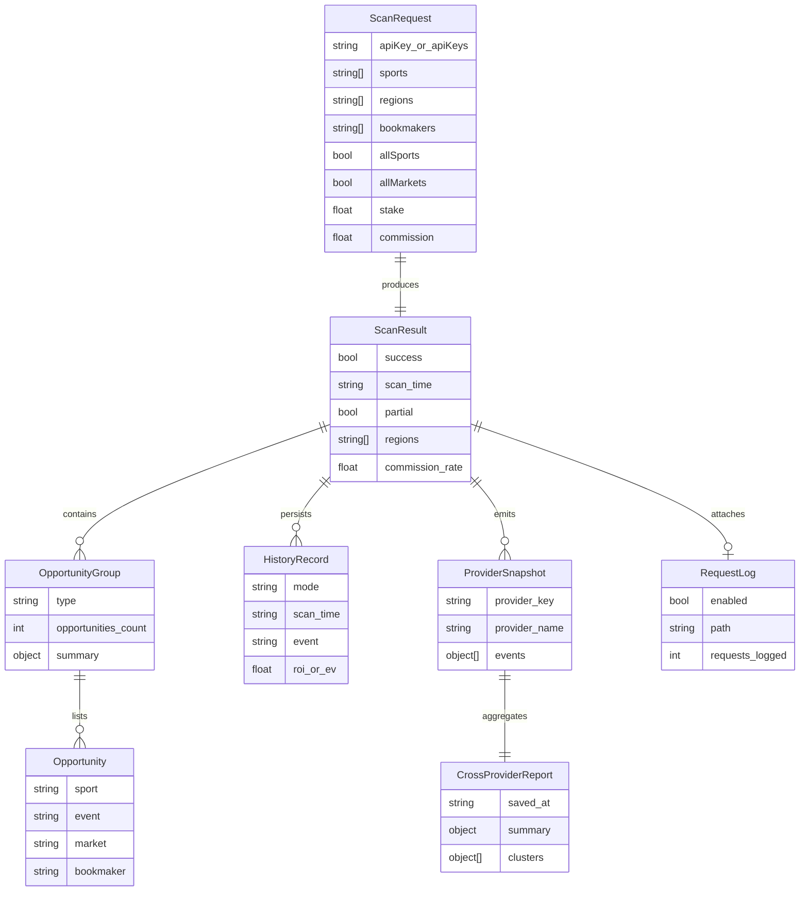
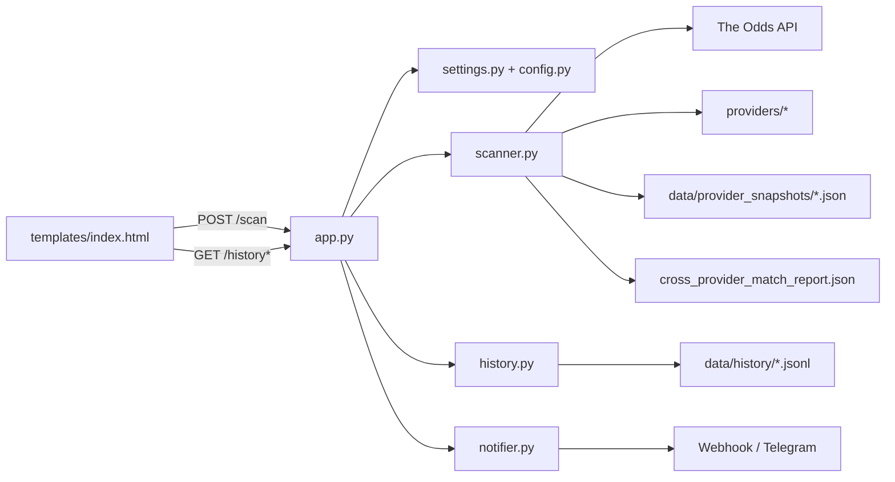

# ARCH

## 1. 技术栈

- 后端：Python、Flask 3.1.1
- HTTP 客户端：`requests`、`httpx`
- 实时连接：`websockets`
- 配置加载：`python-dotenv` + `settings.json`
- 前端：服务端模板 `Jinja2` + 原生 HTML/CSS/JavaScript
- 数据存储：本地 JSON / JSONL 文件
- 测试：`unittest` 驱动，使用 `pytest` 收集执行

## 2. 模块划分

| 模块 | 主要文件 | 职责 |
|---|---|---|
| Web 入口层 | `app.py` | Flask 路由、请求校验、参数归一化、页面渲染、后台服务启停 |
| 扫描核心层 | `scanner.py` | 拉取赔率、合并赛事、计算套利/中间盘/+EV、输出扫描结果 |
| 配置层 | `settings.py`、`config.py`、`settings.json` | 读取配置、注入环境变量、定义默认值和可选项 |
| Provider 适配层 | `providers/` | 统一接入各外部赔率来源，向扫描器返回标准化事件结构 |
| 历史与通知层 | `history.py`、`notifier.py` | 保存机会历史、输出统计、发送 Webhook/Telegram 通知 |
| 前端展示层 | `templates/index.html`、`static/style.css` | 参数面板、结果展示、历史加载、诊断视图 |
| 测试层 | `tests/` | 回归测试、数学逻辑测试、接口输入校验、Provider 解析测试 |
| 验证文档层 | `docs/project_docs/` | 维护 Provider 核验流程、官方文档来源、结果检查标准 |

## 3. 目录结构

```text
edge-scanner/
|-- app.py
|-- scanner.py
|-- config.py
|-- settings.py
|-- settings.json
|-- history.py
|-- notifier.py
|-- providers/
|   |-- __init__.py
|   |-- betdex.py
|   |-- bookmaker_xyz.py
|   |-- dexsport_io.py
|   |-- polymarket.py
|   |-- purebet.py
|   |-- sportbet_one.py
|   `-- sx_bet.py
|-- templates/
|   `-- index.html
|-- static/
|   |-- style.css
|   `-- favicon.ico
|-- tests/
|   |-- test_app_scan_inputs.py
|   |-- test_arbitrage.py
|   |-- test_ev.py
|   |-- test_history.py
|   |-- test_middles.py
|   |-- test_notifier.py
|   |-- test_provider_market_segmentation.py
|   |-- test_scanner_regressions.py
|   `-- ...
|-- data/
|   |-- history/
|   |-- provider_snapshots/
|   `-- scans/
`-- docs/
    |-- provider_rate_limits.md
    `-- project_docs/
```

## 4. 数据模型（ER 图）

说明：本项目没有关系型数据库，以下 ER 图描述的是运行期核心数据对象与文件落盘关系。



## 5. 模块交互关系



交互原则：

- `app.py` 只做输入整形、路由编排和异步副作用触发，不承载赔率计算逻辑。
- `scanner.py` 是唯一的扫描编排中心，统一聚合 API 与各 Provider 数据。
- `providers/__init__.py` 负责注册 Provider Key、标题和别名解析。
- `history.py` 与 `notifier.py` 均为非阻塞配套模块，避免影响主链路响应。

## 6. 核心流程

### 6.1 扫描主流程

1. 前端发起 `/scan` 请求。
2. `app.py` 校验 JSON、解析布尔值、数值和 Provider 选择。
3. `app.py` 调用 `scanner.run_scan(...)`。
4. `scanner.py` 归一化输入，判断是否需要拉取 The Odds API、是否启用自定义 Provider。
5. 扫描器并发拉取体育、赛事和市场数据，并合并为统一事件结构。
6. 扫描器计算：
   - 套利 ROI 与分注
   - 中间盘 gap、概率、EV
   - +EV fair odds、edge、Kelly
7. 扫描器生成 `timings`、Provider 摘要、快照路径、跨 Provider 报告路径并返回。
8. `app.py` 在成功结果下异步写历史、异步发通知、按配置保存最新扫描载荷。

### 6.2 历史与通知流程

1. `/scan` 成功后抽取三类机会列表。
2. `HistoryManager.save_opportunities()` 以 JSONL 追加并按上限裁剪。
3. 若通知配置可用，则在后台线程调用 `Notifier.notify_opportunities()`。

### 6.3 Provider 运行时流程

1. 首页访问与扫描请求会尝试预热后台 Provider 服务。
2. 当前仅 `polymarket` 暴露实时运行时状态。
3. `/provider-runtime/polymarket` 返回 `enabled`、`started`、`ready` 与 `status`。

### 6.4 Provider 核验流程

1. 先执行 Provider 单元/回归测试，确认解析和映射逻辑没有本地回归。
2. 再执行 Provider-only 实时扫描，检查端点是否仍可用、返回是否仍符合实现假设。
3. 如果出现空结果、字段变化、异常赔率、状态码异常或高比例错配，必须回到官方文档核对端点、参数、字段语义和限流要求。
4. 最后抽查扫描输出的顶部机会，确认赛事、盘口、赔率来源、最大下注额和链接都合理。
